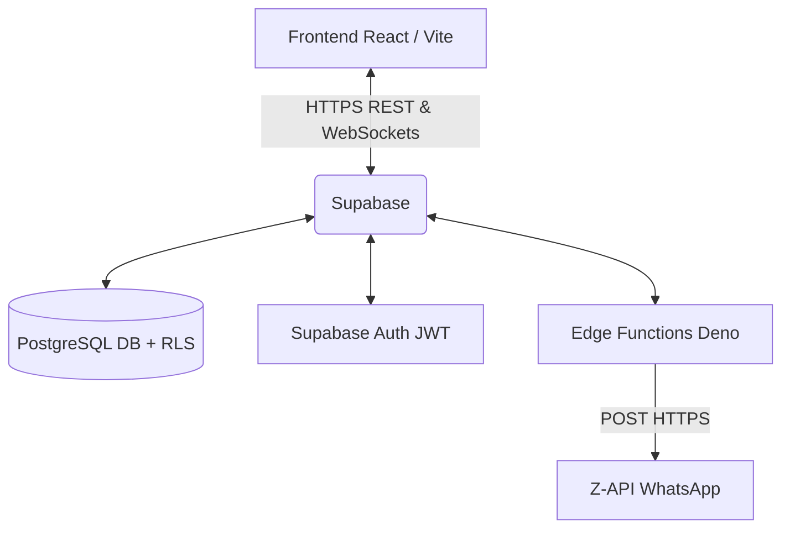

# Visão Geral do Sistema 🏢

O **Sistema de Portaria Inteligente do GGP** foi desenvolvido para centralizar o controle de fluxo de pessoas (visitantes, candidatos, prestadores de serviço) e a gestão das salas de reunião da empresa.

## Arquitetura Principal

O sistema segue uma arquitetura moderna serverless, baseada em **React** no frontend e **Supabase** no backend.

## Stack Tecnológica

| Camada | Tecnologia | Detalhes |
|--------|------------|----------|
| **Frontend** | React + TypeScript + Vite | Componentes UI construídos com `shadcn/ui` e estilizados com `Tailwind CSS`. Todo o design foi moldado com a paleta oficial do Manual da Marca GGP (Azul Petróleo e Mint). |
| **Backend / DB** | Supabase (Postgres) | Utiliza as políticas de RLS (Row Level Security) para garantir que apenas usuários autorizados interajam com os dados. |
| **Autenticação** | Supabase Auth | Sistema de login via e-mail e senha. Existe uma restrição severa de domínios atrelada ao banco de dados para segurança extra. |
| **Notificações** | Edge Functions (Deno) | Scripts no servidor do Supabase que reagem a eventos e disparam mensagens formatadas via Z-API. |

## O Que Este Sistema Resolve?
- **Fim das chamadas telefônicas da recepção:** O sistema avisa o colaborador via WhatsApp assim que seu visitante chega.
- **Evita choque de horários:** A lógica de agendamento impede a reserva de uma mesma sala no mesmo horário.
- **Histórico Seguro:** Tudo é registrado e possui trilha de auditoria para o TI acompanhar ações de exclusão e edição.
- **Autonomia da Operação:** Recepcionistas podem consultar históricos de visitas anteriores e gerenciar agendas com uma UI de alto nível.
